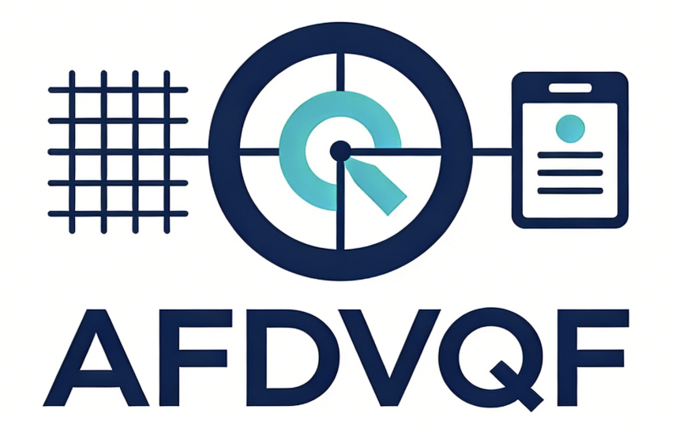

# AFDVQF

<div align="center">
  <h1 align="center">
    
    <br>
    AFDVQF
  </h1>
  <p><b>对齐融合的双分支视觉查询融合多模态命名实体识别</b></p>
  <p>英文名：Alignment-Fusion Dual-branch Vision Query Fusion for Multimodal Named Entity Recognition</p>
  <p>
    <a href="#">项目主页</a> |
    <a href="#">论文</a> |
    <a href="#">数据集</a> |
    <a href="#">海报</a>
  </p>
</div>

**Language:** [English](README.md) | 中文

## 📰 News

- YYYY-MM-DD：TODO - 填写最新进展。

## 👋 Overview

AFDVQF 是一个面向**多模态命名实体识别（MNER）**的研究实现，融合文本与图像信息进行实体抽取。核心模型结合 BERT/Roberta 文本编码器、CLIP 视觉编码器、双分支视觉 token（patch + region）、查询引导融合（QGF）、对齐增强训练与 CRF 解码，并支持**离线本地权重**加载。

<div align="center">
  
</div>

### 亮点

- 文本编码：BERT / Roberta（本地加载）
- 视觉编码：CLIP（本地加载）
- 视觉 token：CLIP patch tokens + Faster R-CNN region tokens（拼接）
- Region token 注入 label / score / box embedding
- Query-guided Fusion（可堆叠多层）
- 可选自适应融合层
- CRF 解码（BIO 标签）
- 可选对齐损失（对比 InfoNCE）
- 适合离线环境的权重路径解析

## 🧩 模型框架

<div align="center">
  
  <p><em>图 1：AFDVQF 整体框架。</em></p>
</div>

## 📊 实验结果

### 对比实验

| 模型 | Twitter2015 F1 | Twitter2017 F1 | NewsMKG F1 |
| --- | --- | --- | --- |
| AFDVQF（本文） | TBD | TBD | TBD |
| Baseline-A | TBD | TBD | TBD |
| Baseline-B | TBD | TBD | TBD |

### 消融实验

| 设置 | Twitter2015 F1 | Twitter2017 F1 | NewsMKG F1 |
| --- | --- | --- | --- |
| Full | TBD | TBD | TBD |
| w/o Alignment | TBD | TBD | TBD |
| w/o Region Tokens | TBD | TBD | TBD |
| w/o Patch Tokens | TBD | TBD | TBD |
| Text Only | TBD | TBD | TBD |

## 🔍 安装

```bash
pip install -r requirements.txt
```

## 🚀 快速开始

1. 准备 `text_encoder` 与 `image_encoder` 的本地权重。

2. 训练。

```bash
bash script/train.sh
```

3. 评估。

```bash
bash script/test.sh <save_name> [split] [device]
```

## 🗂️ 目录结构

- `train.py`：训练入口
- `test.py`：评估入口（读取保存的 checkpoint）
- `config.py`：配置与超参数
- `dataloader.py`：数据处理与加载
- `data/processor.py`：数据处理工具
- `model/base_model.py`：主模型 `AFDVQF`
- `model/dual_vision_extractor.py`：CLIP + Faster R-CNN 视觉 token
- `model/query_guided_fusion.py`：QGF 与自适应融合
- `model/loss_functions.py`：对齐损失定义
- `model/__init__.py`：公共工具
- `script/`：训练/测试脚本（`train.sh`, `test.sh`）
- `requirements.txt`：依赖版本
- `data/no_images.jpg`：缺图样本占位图

## 🗄️ 数据与路径

默认根目录为 `/root/autodl-fs`。

`/root/autodl-fs/data` 目录结构：
- `twitter2015/train.txt`
- `twitter2015/valid.txt`
- `twitter2015/test.txt`
- `twitter2015/twitter2015_images/`
- `twitter2017/train.txt`
- `twitter2017/valid.txt`
- `twitter2017/test.txt`
- `twitter2017/twitter2017_images/`
- `NewsMKG/train.txt`
- `NewsMKG/valid.txt`
- `NewsMKG/test.txt`
- `NewsMKG/`（图片路径直接拼接）

训练输出（默认）：`/root/autodl-fs/save_models/<run_name>`

TensorBoard 日志（默认）：`/root/tf-logs/<run_name>`

如果你的路径不同：
- 修改 `train.py` 中的 `STORAGE_ROOT` / `DATA_ROOT`
- 或仅在评估时设置 `STORAGE_ROOT` / `SAVE_ROOT`

## 💾 本地权重

`text_encoder` 和 `image_encoder` 会通过 `_resolve_path` 解析：
- 绝对路径可直接使用
- 相对路径会在 `/root/autodl-fs` 与项目目录下查找

两者均以 `local_files_only=True` 加载，请确保权重已在本地。

## ⚙️ 配置说明

`config.py` 中的关键参数：
- `text_encoder`, `image_encoder`, `use_image`
- `slots_per_type`, `qfnet_layers`, `qfnet_heads`
- `use_alignment_loss`, `alignment_loss_weight`, `alignment_temperature`
- `use_adaptive_fusion`
- `detector_topk`, `detector_score_thr`, `detector_nms_iou`, `detector_ckpt`

## 🏋️ 训练

```bash
bash script/train.sh
```

或直接运行：

```bash
python train.py
```

## 🧪 评估

`test.py` 会读取保存目录内的 `config.json` 与 `model.pt`：

```bash
bash script/test.sh <save_name> [split] [device]
```

自定义保存根目录：

```bash
SAVE_ROOT=/your/save_models \
python test.py --save_name <run_name>
```

## 🔬 消融实验

我们提供统一的消融脚本：`script/ablation.sh`。

查看可用消融：

```bash
bash script/ablation.sh --list
```

运行全部消融：

```bash
bash script/ablation.sh --exp all --dataset twitter2015 --device cuda:0
```

只运行指定消融：

```bash
bash script/ablation.sh --exp no_region --exp no_align --epochs 30 --batch_size 16
```

可用消融项：
- `full`：完整模型（baseline）
- `no_align`：关闭对齐损失
- `no_adapt`：关闭自适应融合
- `no_region`：只保留 CLIP patch tokens（去掉 region tokens）
- `no_patch`：只保留 region tokens（去掉 patch tokens）
- `text_only`：纯文本
- `qfnet1`：设置 `qfnet_layers=1`

## ✍️ 引用

如有帮助，欢迎引用：

```bibtex
@article{afdvqf,
  title   = {AFDVQF: Alignment-Fusion Dual-branch Vision Query Fusion for Multimodal Named Entity Recognition},
  author  = {TODO},
  journal = {TODO},
  year    = {TODO}
}
```

## 📄 许可证

见 `LICENSE`。

## 🙏 致谢

感谢 PyTorch、Transformers、CLIP 等开源生态。
